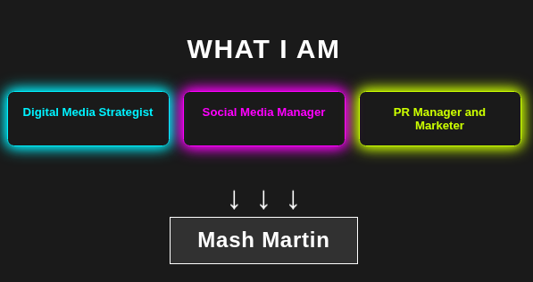

# digital-card

A responsive, animated web profile designed for **Mash Martin**. This project uses HTML5 and CSS3 to create a neon-themed professional introduction featuring glowing pulsing effects and bouncing animations.

## Features

* **Neon Glow Animations:** Three distinct role boxes (Strategist, Social Media, PR) pulse with Cyan, Magenta, and Lime Green breathing effects.
* **CSS Keyframe Animations:** Includes `bounce` effects for directional arrows and infinite `glow` loops.
* **Responsive Design:** Uses Flexbox to ensure the roles stack correctly on mobile devices and align horizontally on desktop.
* **Dark Mode Aesthetic:** Built on a dark gray background (`#1a1a1a`) to maximize color contrast.

## Tech Stack

* **HTML5** - Semantic structure.
* **CSS3** - Styling, Flexbox layout, and Keyframe animations.

## Code Snippet

Here is the core CSS logic responsible for the "Breathing Neon" effect used on the role boxes:

    /* Example of the Cyan Glow Animation */
    .box-1 {
    color: #00f2ff;
    border-color: #00f2ff;
    box-shadow: 0 0 10px #00f2ff;
    animation: glow-cyan 2s infinite alternate;
    }

    @keyframes glow-cyan {
    from {
        box-shadow: 0 0 5px #00f2ff, 0 0 10px #00f2ff;
    }
    to {
        box-shadow: 0 0 20px #00f2ff, 0 0 30px #00f2ff;
    }
    }

## How to Use
Download the index.html file.

Open the file in any modern web browser (Chrome, Safari, Firefox).

No installation or server required.
